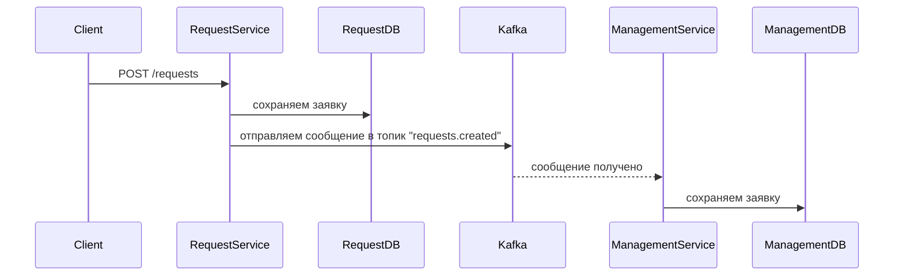

# Kafka Integration: Producer → Consumer

## Как это работает в двух словах



- **request-service** = **Producer** (отправляет сообщения)
- **management-service** = **Consumer** (получает сообщения)
- **Топик** = `requests.created`, 2 партиции (чтобы можно было запустить 2 воркера параллельно)
- **Ключ сообщения** = `building_id` (заявки одного здания попадают в одну партицию — порядок гарантирован)

---

## Шаг 1 — request-service: создаём `kafka_producer.py`

Это отдельный файл, который знает одно — как подключиться к Kafka и отправить сообщение.

**Путь:** `request-service/app/kafka_producer.py`

```python
from aiokafka import AIOKafkaProducer
import json
from app.config import settings

_producer: AIOKafkaProducer | None = None

async def start_producer():
    global _producer
    _producer = AIOKafkaProducer(
        bootstrap_servers=settings.KAFKA_BOOTSTRAP_SERVERS,
        value_serializer=lambda v: json.dumps(v).encode("utf-8"),
        key_serializer=lambda k: str(k).encode("utf-8"),
    )
    await _producer.start()

async def stop_producer():
    if _producer:
        await _producer.stop()

async def publish_request(request) -> None:
    await _producer.send(
        topic="requests.created",
        key=request.building_id,           # заявки одного здания → одна партиция
        value={
            "id": str(request.id),
            "title": request.title,
            "description": request.description,
            "resident_id": request.resident_id,
            "building_id": request.building_id,
            "status": request.status.value,
            "created_at": request.created_at.isoformat(),
        },
    )
```

Зачем `key_serializer` и `value_serializer`? Kafka работает только с байтами, поэтому Python-объекты нужно сериализовать — превратить в байты. JSON — самый простой способ.

---

## Шаг 2 — request-service: обновляем `main.py`

Сейчас там закомментирован `lifespan`. Его нужно раскомментировать и добавить запуск/остановку продюсера.

**Путь:** [`request-service/app/main.py`](request-service/app/main.py)

```python
from fastapi import FastAPI
from contextlib import asynccontextmanager
from app.routers import requests
from app.kafka_producer import start_producer, stop_producer

@asynccontextmanager
async def lifespan(app: FastAPI):
    await start_producer()   # запускаем при старте приложения
    yield
    await stop_producer()    # выключаем при остановке

app = FastAPI(lifespan=lifespan)
app.include_router(requests.router)

@app.get("/")
async def health_check():
    return {"status": "ok"}
```

`lifespan` — это механизм FastAPI: код до `yield` выполняется при старте, код после — при завершении. Продюсер должен жить всё время работы сервиса, поэтому инициализируем его здесь, а не в каждом запросе.

---

## Шаг 3 — request-service: обновляем `service.py`

Здесь уже есть закомментированная строчка `await publish_to_kafka(new_request)` — просто раскомментируем её, подключив правильную функцию.

**Путь:** [`request-service/app/service.py`](request-service/app/service.py)

```python
from app.kafka_producer import publish_request

async def create_request_service(request: RequestCreate, db: AsyncSession) -> Request:
    new_request = await create_request(request, db)
    await db.commit()                       # сначала сохраняем в БД
    await publish_request(new_request)      # потом отправляем в Kafka
    return new_request
```

Важно: `commit` идёт **до** отправки в Kafka. Если сначала отправить в Kafka, а потом упадёт БД — management получит заявку, которой нет в request-db. Делаем наоборот: БД — источник правды.

---

## Шаг 4 — management-service: создаём `kafka_consumer.py`

Консьюмер — это бесконечный цикл, который читает сообщения из топика. Запускается в фоне при старте приложения.

**Путь:** `management-service/app/kafka_consumer.py`

```python
from aiokafka import AIOKafkaConsumer
import json
import asyncio
from app.config import settings
from app.database import async_session_maker

_consumer: AIOKafkaConsumer | None = None
_consumer_task: asyncio.Task | None = None

async def start_consumer():
    global _consumer, _consumer_task
    _consumer = AIOKafkaConsumer(
        "requests.created",                             # топик, который слушаем
        bootstrap_servers=settings.KAFKA_BOOTSTRAP_SERVERS,
        group_id="management-service",                  # группа консьюмеров
        value_deserializer=lambda v: json.loads(v.decode("utf-8")),
        auto_offset_reset="earliest",                   # читать с начала, если offset ещё не был сохранён
    )
    await _consumer.start()
    _consumer_task = asyncio.create_task(_consume_loop())

async def stop_consumer():
    if _consumer_task:
        _consumer_task.cancel()
    if _consumer:
        await _consumer.stop()

async def _consume_loop():
    from app.service import handle_new_request   # импорт здесь, чтобы избежать цикличных импортов
    async for message in _consumer:
        async with async_session_maker() as db:
            await handle_new_request(message.value, db)
            await db.commit()
```

`group_id` — это имя группы. Kafka запомнит, какие сообщения уже были прочитаны этой группой. Если перезапустить сервис — он продолжит с того места, где остановился, а не начнёт заново.

---

## Шаг 5 — management-service: обновляем `main.py`

**Путь:** [`management-service/app/main.py`](management-service/app/main.py)

```python
from fastapi import FastAPI
from contextlib import asynccontextmanager
from app.kafka_consumer import start_consumer, stop_consumer

@asynccontextmanager
async def lifespan(app: FastAPI):
    await start_consumer()   # запускаем при старте
    yield
    await stop_consumer()    # останавливаем при завершении

app = FastAPI(lifespan=lifespan)

@app.get("/")
async def health_check():
    return {"status": "ok"}
```

---

## Шаг 6 — management-service: пишем `repo.py`

**Путь:** [`management-service/app/repo.py`](management-service/app/repo.py)

```python
from sqlalchemy.ext.asyncio import AsyncSession
from app.models import Request
from app.database import StatusEnum
from uuid import UUID

async def create_request(data: dict, db: AsyncSession) -> Request:
    request = Request(
        id=UUID(data["id"]),
        building_id=data["building_id"],
        title=data["title"],
        description=data["description"],
        status=StatusEnum(data["status"]),
    )
    db.add(request)
    await db.flush()
    return request
```

---

## Шаг 7 — management-service: пишем `service.py`

**Путь:** [`management-service/app/service.py`](management-service/app/service.py)

```python
from sqlalchemy.ext.asyncio import AsyncSession
from app.repo import create_request

async def handle_new_request(data: dict, db: AsyncSession) -> None:
    await create_request(data, db)
```

Пока логика простая — принял → сохранил. В будущем здесь можно будет добавить назначение воркера, уведомления и т.д.

---

## Итоговая структура изменений

- `request-service/app/kafka_producer.py` — **новый файл**
- `request-service/app/main.py` — добавляем lifespan с запуском продюсера
- `request-service/app/service.py` — добавляем вызов `publish_request` после commit

- `management-service/app/kafka_consumer.py` — **новый файл**
- `management-service/app/main.py` — добавляем lifespan с запуском консьюмера
- `management-service/app/repo.py` — пишем функцию сохранения заявки
- `management-service/app/service.py` — пишем обработчик входящего сообщения

Топик `requests.created` с 2 партициями Kafka создаст автоматически при первой отправке (в docker-compose включён `KAFKA_AUTO_CREATE_TOPICS_ENABLE: "true"`). Ничего дополнительно настраивать не нужно.
