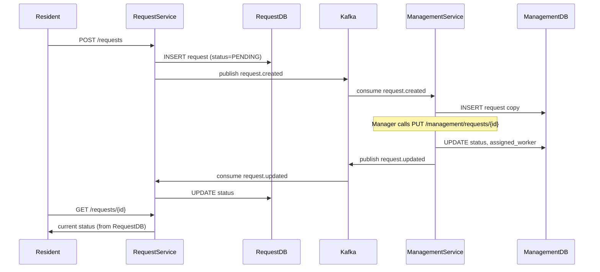

# Resident Request Platform — Architecture Plan

## What to Remove (Simplification First)

These are cut from the MVP to avoid unnecessary complexity:

---

## Services (3 total, 2 application services)

### 1. `request-service` — Public-facing API

**Responsibility:** The only service residents interact with. Owns the source-of-truth for request state from the resident's perspective.

- `POST /requests` — create a new request, save to its own DB, publish `request.created` to Kafka
- `GET /requests/{id}` — return current request status (polling)
- `GET /requests?resident_id=...` — list a resident's requests
- Kafka **producer**: publishes `request.created` events
- Kafka **consumer**: listens for `request.updated` events, updates its own DB

### 2. `management-service` — Internal management API

**Responsibility:** Consumes resident requests, performs business operations, publishes status updates back.

- `GET /management/requests` — list all requests visible to this company
- `PUT /management/requests/{id}` — update status, assign a worker
- Kafka **consumer**: listens for `request.created`, stores a copy in its own DB
- Kafka **producer**: publishes `request.updated` events after any status change

---

## Event-Driven Data Flow




---

## Kafka Topics


| Topic              | Producer           | Consumer           | Payload                                                              |
| ------------------ | ------------------ | ------------------ | -------------------------------------------------------------------- |
| `requests.created` | request-service    | management-service | request_id, title, description, building_id, resident_id, created_at |
| `requests.updated` | management-service | request-service    | request_id, status, assigned_worker, updated_at                      |


**Consumer Groups:**

- `management-group` — management-service subscribes to `requests.created`
- `request-sync-group` — request-service subscribes to `requests.updated`

---

## Request Lifecycle / Status States

```
PENDING → ASSIGNED → IN_PROGRESS → RESOLVED → CLOSED
```

- `PENDING` — set by request-service on creation
- `ASSIGNED` — set by management-service when a worker is assigned
- `IN_PROGRESS` — set by management-service when work begins
- `RESOLVED` — set by management-service when done
- `CLOSED` — optionally confirmed by resident (or auto-close; skip for MVP)

---

## Database Schemas

Each service owns its DB. No cross-service DB access.

**request-service DB** (`request_db`)

- `requests`: `id (uuid PK)`, `resident_id`, `building_id`, `title`, `description`, `status`, `assigned_worker (nullable)`, `created_at`, `updated_at`

**management-service DB** (`management_db`)

- `requests`: `id (uuid PK, same as source)`, `title`, `description`, `building_id`, `status`, `assigned_worker (nullable)`, `comments (text, nullable)`, `created_at`, `updated_at`

---

## Project Folder Structure

```
resident-request-platform/
├── docker-compose.yml
├── request-service/
│   ├── Dockerfile
│   ├── requirements.txt
│   └── app/
│       ├── main.py
│       ├── models.py          # SQLAlchemy models
│       ├── schemas.py         # Pydantic schemas
│       ├── database.py        # engine, session
│       ├── routers/
│       │   └── requests.py
│       ├── kafka/
│       │   ├── producer.py    # publish request.created
│       │   └── consumer.py    # consume request.updated (background task)
│       └── alembic/
├── management-service/
│   ├── Dockerfile
│   ├── requirements.txt
│   └── app/
│       ├── main.py
│       ├── models.py
│       ├── schemas.py
│       ├── database.py
│       ├── routers/
│       │   └── requests.py
│       ├── kafka/
│       │   ├── producer.py    # publish request.updated
│       │   └── consumer.py    # consume request.created (background task)
│       └── alembic/
```

---

## Docker Containers (6 total)


| Container            | Image                        | Purpose                                                       |
| -------------------- | ---------------------------- | ------------------------------------------------------------- |
| `request-service`    | custom (FastAPI)             | Resident API + Kafka consumer loop                            |
| `request-db`         | `postgres:16`                | request-service's database                                    |
| `management-service` | custom (FastAPI)             | Management API + Kafka consumer loop                          |
| `management-db`      | `postgres:16`                | management-service's database                                 |
| `kafka`              | `bitnami/kafka` (KRaft mode) | Event bus — no Zookeeper needed                               |
| `kafka-ui`           | `provectuslabs/kafka-ui`     | Optional browser UI to inspect topics/messages while learning |


> KRaft mode (Kafka without Zookeeper) keeps the container count low and is the modern default.

---

## What NOT to Build Right Now

- No authentication / authorization
- No API Gateway / reverse proxy (Nginx)
- No Notification Service
- No WebSockets (use GET polling)
- No Saga or distributed transaction pattern
- No true Outbox Pattern (add as a follow-up exercise)
- No Prometheus / Grafana (mark as Phase 2)
- No multiple management companies / tenancy
- No file uploads or media handling

---

## Learning Milestones (suggested order)

1. Stand up Kafka + both DBs in Docker Compose, verify connectivity
2. Implement `request-service`: POST + GET routes, SQLAlchemy models, Alembic migration
3. Add Kafka producer to `request-service` (publish on create)
4. Implement `management-service`: Kafka consumer saves to its own DB
5. Add management API: PUT to update status + Kafka producer for `request.updated`
6. Add Kafka consumer to `request-service` to receive updates and sync status
7. Test full round-trip: create → assign → resolve → poll for status
8. (Optional Phase 2) Add Nginx, Prometheus, Grafana, true Outbox Pattern

---

## Python Dependencies (both services, shared)

```
fastapi
uvicorn[standard]
sqlalchemy[asyncio]
alembic
asyncpg
pydantic
aiokafka          # async Kafka client for Python
python-dotenv
```

